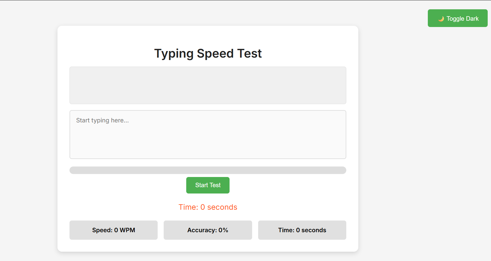
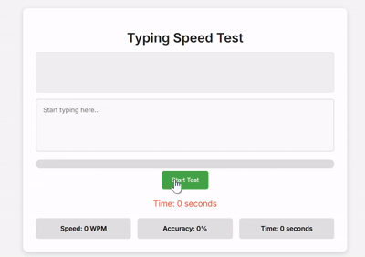
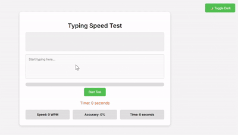

# 🚀 TurboTypeApp – Speed Up Your Fingers, Sharpen Your Mind

**TurboTypeApp** is a sleek, modern typing speed web application built using **Flask** and **vanilla JavaScript**. It’s more than just a speed test — it’s designed to sharpen focus, improve accuracy, and enhance muscle memory with a clean interface and real-time feedback.

  
<sub><i>Beginner-friendly and intuitive interface</i></sub>

---

## 🧠 Features

- ✅ **Real-Time WPM & Accuracy** – Instant speed and correctness feedback  
- ✅ **Randomized Prompts** – New sentence each session to improve adaptability  
- ✅ **Dark Mode Toggle 🌙** – Seamless theme switching, no reload required  
- ✅ **Live Progress Bar** – Visual tracker that evolves with typing  
- ✅ **Robust Analytics** – Backend tracks performance and errors  
- ✅ **Responsive Design** – Optimized layout with CSS transitions  
- ✅ **100% Vanilla JS** – Framework-free, lightweight implementation  
- ✅ **API-Ready Backend** – CORS-enabled Flask API built to scale

---

## 🎥 Demo Preview

<table>
  <tr>
    <td><b>🌞 Light Mode</b></td>
  </tr>
  <tr>
    <td></td>
  </tr>
  <tr>
    <td><b>🌙 Dark Mode</b></td>
  </tr>
  <tr>
    <td></td>
  </tr>
</table>

---

## 🛠️ Tech Stack

- **Frontend:** HTML, CSS, JavaScript  
- **Backend:** Python (Flask, Flask-CORS)  
- **Tools & Concepts:** REST APIs, JSON, DOM manipulation

---

## 📁 Project Structure

```
TurboTypeApp/
├── app.py
├── requirements.txt
├── README.md
├── templates/
│   └── index.html
├── static/
│   ├── script.js
│   └── scripts.css
├── assets/
│   ├── defaulthomepagescreenshot.png
│   ├── workingdemovideo.gif
│   ├── workingdemovideo.mp4
│   ├── darkmodescreenshot.png
│   ├── darkmodeworkingdemovideo.gif
│   └── darkmodeworkingdemovideo.mp4
```

---

## 🚀 Local Setup

```bash
git clone https://github.com/YOUR_USERNAME/TurboTypeApp.git
cd TurboTypeApp
pip install -r requirements.txt
python app.py
```

Then open your browser and visit:  
👉 **http://127.0.0.1:5000/**

---

## 🎯 Why It Stands Out

> “It may look simple, but it teaches complex skills recruiters love.”

- **Full-stack integration:** HTML → JavaScript → Flask API → JSON roundtrip  
- **Asynchronous logic:** Live DOM events, keystroke tracking, and real-time rendering  
- **UI polish & UX focus:** Progress bar, theme toggle, adaptive layout  
- **Extensible backend:** Future support for login, leaderboard, or multiplayer modes

---

## 📚 Highlights & Learnings

- Flask routes, API building, and CORS management  
- JavaScript event handling and performance tracking  
- Clean, responsive UI architecture from scratch  
- Real-time frontend–backend communication with JSON  
- Debugging and logging for production-level code  
- Accessibility and dark mode integration

---

## 📄 License

This project is licensed under the **MIT License**.

---

## 🌟 Support This Project

Star the repo, fork it, or share it with others — every bit helps. Let’s build better tools, one app at a time. ✨
